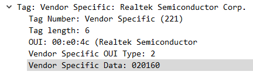
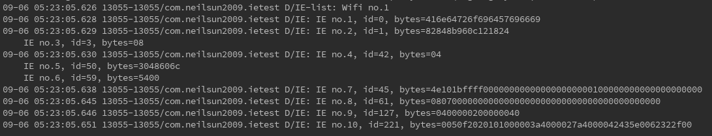

# Mosent Log by Sun Zhanbo, Week 1

## 04/09/2018
### Additional Message on 802.11 Probe Response Frame

There are two types of frame components in a Wi-Fi management frame: one is fixed length, called *fixed fields*, the other one is variable length, called *information elements*.

In probe response frames, specifically, the information elements are as follows:
    
  1. SSID
  2. Supported rates
  3. Country info
  4. FH pattern table
  5. IBSS DFS
  6. Extended supported rates
  7. Robust security network

In addition, 802.11 supports **vendor specific** information elements, which could be used to store and transmit self defined information. And this is what we are going to use.


As is shown here.



### Message Receival on Android

There are two ways of extracting detailed probe request frames on Android.

The first approach is to make use of JNI to directly exchange information with Linux kernel, as is shown is [3]. However this means a lot of additional work and may even requires ROOT privilege.

The second is to exploit the hidden methods and members in Android Java code. In class *android.net.wifi.ScanResult*, there are information elements defined, and saved in raw data.

### Reference

  1. 802.11 Wireless Networks: The Definitive Guide, 2nd Edition by Matthew S. Gast, Chapter 4. 802.11 Framing in Detail
https://www.safaribooksonline.com/library/view/80211-wireless-networks/0596100523/ch04.html
  2. CWAP 802.11- Probe Request/Response
https://mrncciew.com/2014/10/27/cwap-802-11-probe-requestresponse/

  3. LoWS - Location-based Wi-Fi Services - A Complete Open Source Solution for Wi-Fi Beacon Stuffing Based Location-based Services, WMNC 2016 https://www.tkn.tu-berlin.de/fileadmin/fg112_hpzehl/slides/wmnc16_lows_zehl.pdf

  4. What does @hide mean in the Android source code?https://stackoverflow.com/questions/17035271/what-does-hide-mean-in-the-android-source-code

  5. Wi-Fi scanning overview - Android Official Guides https://developer.android.com/guide/topics/connectivity/wifi-scan

## 05/09/2018

### Android IE Test App

There are two approaches to retrieve IE information on Android without using JNI.

The first is to use Java reflection to use @hide members and methods, the second is to rebuild android.jar upon that.

For simplicity, I first tried the first approach.

### Java Reflection

Check out the *android.net.wifi.ScanResult* class, and find that there defines InformationElement static class, which contains two fields: id (int) and bytes (byte[]).

We construct a similar class called MyIE, in order to receive the data.
```java
public class MyIE {
    public static final int EID_SSID = 0;
    public static final int EID_SUPPORTED_RATES = 1;
    public static final int EID_TIM = 5;
    public static final int EID_BSS_LOAD = 11;
    public static final int EID_ERP = 42;
    public static final int EID_HT_CAPABILITIES = 45;
    public static final int EID_RSN = 48;
    public static final int EID_EXTENDED_SUPPORTED_RATES = 50;
    public static final int EID_HT_OPERATION = 61;
    public static final int EID_INTERWORKING = 107;
    public static final int EID_ROAMING_CONSORTIUM = 111;
    public static final int EID_EXTENDED_CAPS = 127;
    public static final int EID_VHT_CAPABILITIES = 191;
    public static final int EID_VHT_OPERATION = 192;
    public static final int EID_VSA = 221;

    public int id;
    public byte[] bytes;

    public MyIE() {
    }

    public MyIE(int id, byte[] bytes) {
        this.id = id;
        this.bytes = bytes.clone();
    }

    public MyIE(MyIE ie) {
        this.id = ie.id;
        this.bytes = ie.bytes.clone();
    }
}
```

Use method from Android official guide to scan Wi-Fi, and refer to [1] to get reflections from InformationElement[].

```java
// get information elements details
    // and copy them back to MyIE instances
    private MyIE[] getInformationElements(ScanResult result) {
        try {
            // get hidden class android.net.wifi.ScanResult
            Class ScanResult;
            ScanResult = Class.forName("android.net.wifi.ScanResult");
            // get field informationElements and get its value in the instance
            Field field = ScanResult.getField("informationElements");
            Object informationElements = field.get(result);
            int ieCount = Array.getLength(informationElements);
            if (ieCount == 0) {
                return null;
            }
            // get InformationElement hidden class and its members
            Class InformationElement = Array.get(informationElements, 0)
                    .getClass();
            Field ieIdField = InformationElement.getField("id");
            Field ieBytesField = InformationElement.getField("bytes");
            // new MyIE array instance
            MyIE[] ies = new MyIE[ieCount];
            // loop on each original IE
            for (int i = 0; i < ieCount; ++i) {
                // get ie.id
                Object informationElement = Array.get(informationElements, i);
                int realId = ieIdField.getInt(informationElement);
                // get ie.bytes
                // note that ie.bytes is an array, therefore the array reflection ops
                Object midBytes = ieBytesField.get(informationElement);
                int byteLength = Array.getLength(midBytes);
                byte[] realBytes = new byte[byteLength];
                for (int j = 0; j < byteLength; ++j) {
                    realBytes[j] = Array.getByte(midBytes, j);
                }
                // assignment
                ies[i] = new MyIE(realId, realBytes);
            }
            return ies;
        } catch(Exception e) {
            e.printStackTrace();
            return null;
        }
    }
```

The works well on virtual devices (API 28). 



However, on the physical device (API 19), the method fails. And this is due to two issues:
  
  1. The boolean flag we use to check if Wi-Fi scan is successful: *EXTRA_RESULTS_UPDATED*, is introduced since API 23, so even the scan results are getting back, the method calls it a failure. However this is easy to fix, just can getScanResults() every time, since it saves the scan result from last successful scan anyway.
  
  2. The *InformationElement* class is also introduced later than API 19, from Android 5 (API 21).
  
So our method encounters a giant problem in terms of compatibility. Instead of rebuilding another android.jar, maybe it's more practical to just restrict the minimum version required to be API 21.


### Reference
  1. Java Array Reflection
  https://blog.csdn.net/vonzhoufz/article/details/39377647

## 06/09/2018

### Further Test on IE Test App

Change the log display of bytes to hex representation, refering Jiajie's code.

Add a check on whether the *informationElements* field on a Wi-Fi network is null.

On a Sumsung tablet device (API 23), the *informationElements* field in *ScanResult* instances are all empty. The reason behind this is yet to be found.


### Reference