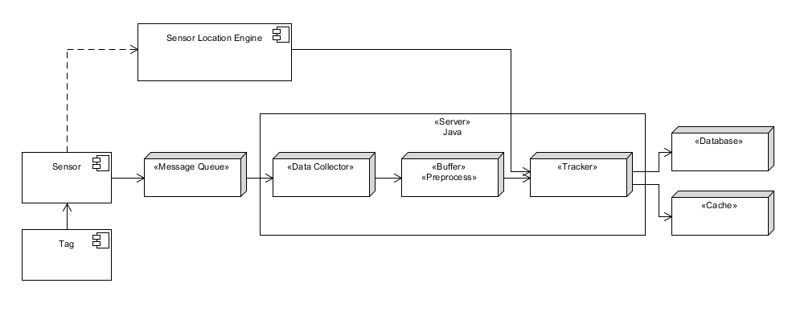

# Week 2
## 11/09/2018
### Permission Request on Android

After installing an app on Android, some permissions won't be immediately granted for the app, in terms of Wi-Fi scan, the location permission. There for, there should be code put forward to check the permission and earn the user's consent, before starting the Wi-Fi scan.

### New Class: MyWifiScanner

Reorganize the code concerning Wi-Fi scanning to a new class: *MyWifiScanner*, to give the code a more structural and extendable view.

The class contains following members and methods, for now:
  + private WifiManager wifiManager
  + public MyWifiScanner(Context context)
  + public boolean startWiFiScan()
  + public List<ScanResult> scanSuccess()
  + public List<ScanResult> scanFailure()
  + public ArrayList<MyIE[]> getIEList(List\<ScanResult\> results, int targetId)
  + private MyIE[] getInformationElements(ScanResult result)

To utilize this class, the outer app needs to:
  1. initialize an instance
  2. register a broadcast receiver for scanning result as in

  ```java
  wifiScanReceiver = new BroadcastReceiver() {
    @Override
    public void onReceive(Context c, Intent intent) {
      // WifiManager.EXTRA_RESULTS_UPDATED is added on API23
      boolean success = intent.getBooleanExtra(
          WifiManager.EXTRA_RESULTS_UPDATED, false);
      if (success) {
        handleScanResult(scanner.scanSuccess());
      } else {
        // scan failure handling
        handleScanResult(scanner.scanFailure());
      }
    }
  };
  IntentFilter intentFilter = new IntentFilter();
  intentFilter.addAction(WifiManager.SCAN_RESULTS_AVAILABLE_ACTION);
  this.getApplicationContext().registerReceiver(wifiScanReceiver, intentFilter);
  ```
  
  3. check for permission
  4. start scan
  5. handle the scanning results and information elements

### Some Notes on the Paper
  1. On prior probability, posterior probability, maximal likelihood, etc. https://blog.csdn.net/yangang908/article/details/62215209
    
  2. Conditional probability: p(x1, x2) = p(x2) * p(x1|x2)
      Bayes' theorem: p(x|y) * p(y) = p(y|x) * p(x)
  3. On particle filter https://blog.csdn.net/piaoxuezhong/article/details/78619150

### Reference
  1. SCAN_RESULTS_AVAILABLE_ACTION return empty list in Android 6.0 (Permission Request) https://stackoverflow.com/questions/32151603/scan-results-available-action-return-empty-list-in-android-6-0/32151901#32151901

## 12/09/2018

### Paper Notes Cont.

  1. Formulars yet to understand:
    (1), (10)

## 13/09/2018

### Server Structure


### Selection of Message Queue (MQ) Component

A brief summary of mainstream MQ systems:

1. RabbitMQ: high stability, robust, Android support
2. ActiveMQ: performance is generally not so good as RabbitMQ
3. Kafka: high throughput, targeted on log management, thus lack some MQ features
4. ZeroMQ: an improved socket, no distribution, no data persistence (when the server is down, the data is lost)

To conclude, RabbitMQ should be used to implement the MQ component.

### Reference
1. Apache Kafka https://kafka.apache.org/intro#kafka_mq
2. Differences between Kafka, RabbitMQ and ZeroMQ https://www.zhihu.com/question/22480085
3. Get started with RabbitMQ on Android (Eclipse) https://www.cloudamqp.com/blog/2014-10-28-rabbitmq-on-android.html
4. Comparisons between RabbitMQ, ActiveMQ, ZeroMQ and Kafka https://blog.csdn.net/linsongbin1/article/details/47781187