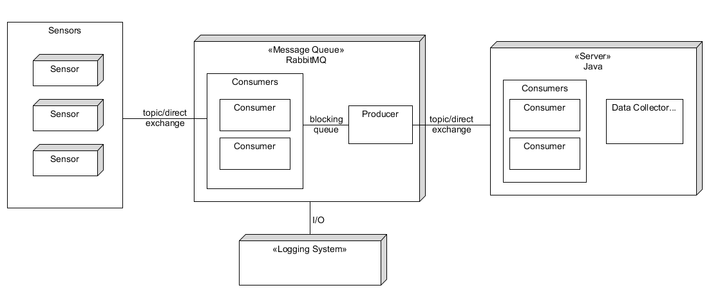

# Week 3
## 18/09/2018
### Learning RabbitMQ
1. RabbitMQ is a message broker: it accepts and forwards messages. Producing means nothing more than sending. A program that sends messages is a producer. A queue is the name for a post box which lives inside RabbitMQ. Consuming has a similar meaning to receiving. A consumer is a program that mostly waits to receive messages.
2. ConnectionFactory -> connection -> channel -> publish/consume
3. Round-Robin task scheduling between multiple workers.
4. Message acknowledgement, once a worker dies, the queue will re-allocate the message to another worker, thus the message won't lost. **DON'T FOTGET TO SEND basicAck once done receiving!**
5. Message durability, declare the queue and message as durable to ensure the message won't lost even if the server dies. Also, when publish, we need to declare the message as persistent. For a more robust of this persistence setting, we can use *publisher confirms*.
6. By using the following code, the Round-Robin scheduling will be more approporiate when it comes to situations like all even numbered tasks are time-consuming.
```java
int prefetchCount = 1;
channel.basicQos(prefetchCount);
```
7. Publish/subscribe pattern: deliver one message to multiple consumers - **full messaging model**. This uses exchange type "fanout".
8. The producers don't actually send messages to queues, instead they are sent to exchanges. The exchange knows exactly what to do with messages, while the producers don't. The rules the exchanges handle the messages are defined by *exchange type*. Also, consumer uses *queueBind* instead of *queueDeclare* to connect with the queue of that exchange.
9. If we need a queue that only concerns on currently flowing messages, not the old ones, we may want temporary queues. Firstly, whenever we connect to Rabbit, the server chooses a name for us. Secondly, once we disconnect the consumer the queue is automatically deleted.
When we supply no parameters to queueDeclare() in consumers, we create a non-durable, exclusive, autodelete queue with a generated name.
10. Subscribe to only a subset of the messages: using routing key/binding key for the producer/consumer. The binding key depends on the exchange type, fanout exchanges ignore this, direct exchanges work.
11. Subscribtion based on the source which emitted the message (along with above, multiple criteria) - *topic exchange*. For this type of exchange, the format of routing key and binding key is a list of words, delimited by dots, like "quick.orange.rabbit".
12. Two special binding keys:* (star) can substitute for exactly one word.
\# (hash) can substitute for zero or more words.
13. Remote Procedure Call (RPC). More at https://www.rabbitmq.com/tutorials/tutorial-six-java.html.

### Reference
1. RabbitMQ Tutorials https://www.rabbitmq.com/getstarted.html

## 19/09/2018
### Design of RabbitMQ Module in the System
1. Sensors are producers.
2. The MQ module acts both as a consumer and a producer.
3. The Java server implements a consumer interface.
4. From sensors to MR: implement a direct/topic exchange. There are multiple sensors (producers) and multiple consumers (who share a queue and handle the messages in a Round-Robin fashion). Message acknowledgement and durability should also be considered.
5. From MR consumer to MR producer: when consumers get messages, there should be an internal channel where the messages will get to the producer inside MR. This is to be best implemented via a blocking queue (example in [1]).
6. MR to server: implement a direct/topic exchange. There are one producer and one or more consumers (if more, they should share a queue and handle the messages in a Round-Robin fashion). Message acknowledgement and durability should also be considered.
7. More on MR module: except for re-directing some values to the server, the MR module may also log the original data onto disks.
8. MR module structure: 

### Reference
1. Get started with RabbitMQ on Android (Android Studio) https://www.cloudamqp.com/blog/2015-07-29-rabbitmq-on-android.html
2. Blocking Queue in Android https://developer.android.com/reference/java/util/concurrent/BlockingQueue#remove(java.lang.Object)

## 20/09/2018
### Test of RabbitMQ: from Android to MQ Module
1. Implement a RabbitMQ producer on Android, using the method from [1] (previous day).
2. Note that connection and producing methods must be wrapped in a new thread, it should be async with the UI main thread.
3. Use RabbitMQ Client 4.x to be compatible with Android API 4.x
4. Set a set of username/password "admin:admin" to the RabbitMQ server side, to enable remote access.

### Reference
1. Basics for RabbitMQ https://geewu.gitbooks.io/rabbitmq-quick/content/RabbitMQ%E5%9F%BA%E7%A1%80%E6%93%8D%E4%BD%9C.html
