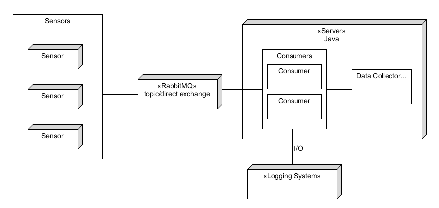

# Week 4
## 24/09/2018
### Test of RabbitMQ: from Android to MQ Module (Cont.)
1. If use factory.setUri(), then virtual host of the RabbitMQ server must be specified. Note that this virtual host can also be used to logically distribute messages.
2. By using factory.setUsername(), factory.setHost() etc. seperately, won't be needing the specified vhost, i.e. default vhost ('/') can be used.

### iBeacon on Mosent
1. iBeacon will not listen to other sensors, so there are no cooperation feature among tags.
2. RSS matrix is replaced through learning with a simplified signal propagation model.
3. iBeacons send out beacons via Bluetooth, mobile phones capture them and upload them to the server.

### Reference
1. Access Control (Authentication, Authorisation) in RabbitMQ http://www.rabbitmq.com/access-control.html
2. Networking and RabbitMQ https://www.rabbitmq.com/networking.html
3. Connection to RabbitMQ https://www.rabbitmq.com/api-guide.html#connecting

## 26/09/2018
### iBeacon on Mosent (Cont.)
1. Particle filter for continuous detection (not vulneratble with noises), trilateration for initialize the particles (efficient).
2. Program outline:
  * Note: Paper1 stand for "Cooperative Target Tracking and Signal Propagation Learning Using
Mobile Sensors". Paper2 stands for "iBeacon-based Implementation for Mosent".
  * Particle (re-)initialization: Paper2 3.2.
  * Within each iteration, generate new particle locations: Paper1 (4)
  * Update the weights: Paper1 (6) & Paper2 (4, 5) Note that the distance between x and y is estimated using Paper2 (3)
  * Expected location at this iteration: Paper1 (7)
  * Resampling after each iteration: Paper1 P8 last paragraph & Paper1 (4)

## 27/09/2018
### MQTest on Android Tablet
1. Open the access for port 15672 and 5672 in the firewall.
2. Both designated v-host and default v-host can be connected and message queue is valid.
### Renewval on MQ Module
When I look back to the structure of MQ module proposed on Week 3, I found some problems with redundancies. The extra layer of "consumer -> producer" inside the MQ subsystem is useless. A simple sensor (producer) -> server (consumer) structure seems to make more sense.

The structure can be described as follows: 

From sensors to server: implement a direct/topic exchange. There are multiple sensors (producers) and multiple consumers (who share a queue and handle the messages in a Round-Robin fashion). Message acknowledgement and durability should be considered.

