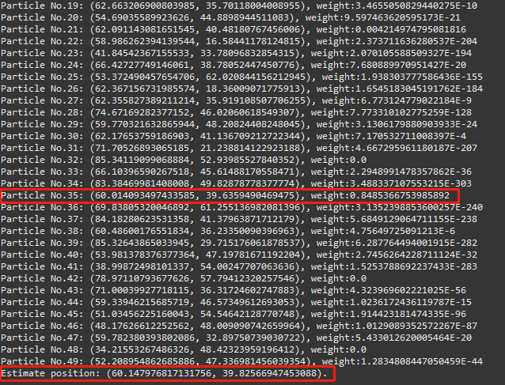
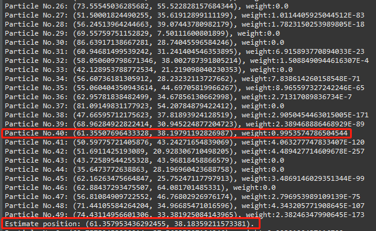

# Week 6
## 09/10/2018
### MQ Module
1. As this is a real time application, the need for data durability and data acknowledgement seem not of great concern, i.e. if the server is down, no calculation is done whatsoever at that time slot, and it's really no use to keep the data. 
2. A more thorough understanding towards this module. The MQ module is more like a middleware and can be deployed on a seperate server. The clients and Java server will use RabbitMQ's communication protocal to connect with the MQ server. The MQ server is afterwards responsible for collecting and distributing message data from producers and to consumers.
3. Add auto reconnection feature on consumer start-up.

## 10/10/2018
### Particle Filter
1. Implemented using Java.
2. Classes, members & methods: 
    * **Particle**: Representation of one particle.
      + Point pos: position
      + double weight: weight
      + Particle(Point pos, double weight): initialize a particle.
      + void randomMove(double radius): move the particle randomly within a given radius.
      + void setWeight(double weight): set a new weight.
      + double probability(Point[] sensors,double sigma, double[] measurements): calculate the posterior probability
    * **ParticleFilter**: A set of particles combining into one filter.
      + Particle[] particles: set of particles.
      + int count: number of particles.
      + Point[] sensors: locations of sensors.
      + int sensorCount: number of sensors.
      + double radius: radius for the particles to be randomly placed.
      + ParticleFilter(int count, Point center, double radius, Point[] sensors): initialize a set of particles.
      + void reassignWeights(double[] measurements, double sigma): // reassign normalized weights
      + Point estimate(): get estimated location.
      + void resample(): resample based on the weights.
      + *private* double[] calProbability(double[] measurements, double sigma): calculate probabilities of all particles with regards of sensors.
    * **Utils**: A class with static math methods.
      + *static* double distance(Point p1, Point p2): Euclidean distance.
      + *static* double gaussian(double mu, double sigma, double x): Gaussian probability.
    * **Point**: Point in a 2-d coordinate.
      + double x, y: co-ordinates.
      + Point(double x, double y), Point(Point p): construct function.
3. Git respository: https://github.com/neilsun2009/particle_filter

### Reference
1. An implementation of particle filter: https://github.com/erhs-53-hackers/Particle-Filter

## 11/10/2018
### Test on Particle Filters
1. Suppose the map is 80*60, four sensors are placed at the corner, measurements are given with or without noise. The target we are searching for is (60, 40). 50 particles, radius 30, starting point at (40, 30).
2. After 50 rounds of iterations, the particle filter converges approximately to the target point. More iterations may get even better results
3. Results on measurements with no noise (sigma=1):

4. Results on measurements with noise (sigma=0.7):

### Possible Improvements and Modifications:
1. **measurements** may be a member of the filter and be fed to the instance in construct function, insteaed of as a input to the **reassignWeights** function. As the measurements should be static while this calculation runs in real-time to give one result.
2. The same situation may be applies to noise representation **sigma**.
3. Iteration may be set as a method within **ParticleFilter** class.
4. Check on illegal inputs, e.g. if the sizes of sensors and measurements are consistent.
5. Some methods and members may be kept private.