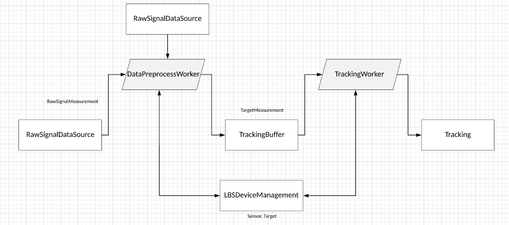

# Week 8
## 23/10/2018
### Non-Linear LSQ Initialization
1. As is discussed last week, the starting point for performing a trilateration using non-linear LSQ is tricky to select.
2. One way suggested by a slide is that to initialize the problem with a linear LSQ solution. However, we all know that linear LSQ is vulnerable to singular matrix and that problem is exactly what haunts the non-linear initialization.
3. An intuitive way is to calculate the initial point by take an average on all referencce points [1]. And this has been working surprisingly well. And thus we will stick to it before something more constructive comes forward.

### Reference
1. Sample code with avg initialization https://github.com/lemmingapex/trilateration

## 24/10/2018
### Integration of the Modules
The pipeline of the localization system:
1. Input is sensing data between targets and sensors.
2. Sensor locations are provided via a black box system.
3. The input delivered from RabbitMQ system will be classified by different targets.
4. If previous data of one target from not long ago has been collected, then the new data is sent directly to the Particle Filter module to perform a localization.
5. The particle filter will then use last steps' position as the initial point.
6. The sensors should be id-ed, and therefore update real-time sensor data individually (make sure that the sensor positions and measurements are not duplicated).
7. If the target is new or hasn't been collected for a long time, it first goes through the Least Square module to get an initial position (provided more than two seperate sensing data has been collected).
8. Then the target is ready to join the particle filter process.

## 25/10/2018
### Project in a Whole
A backbone structure of Mosent by Jiajie. The data flow is like this:

Some notes:
1. The RawSignalDataSource is data retrieved from MQ. They are id-ed by sensors, i.e. each contains a sensor id and a list of detected targets by that sensor.
2. The MQ system therefore is the upstream of the RawSignalDataSource.
3. DataProcessWorker will integrate the tracking data id-ed by sensors (RawSignalDataSource) with SensorLocationDataSource (typo on the graph), and transform the data to be id-ed by targets.
4. This worker will work routinely say once every 1-3 second(s). The new target-id-ed data will then be sent to TrackingBuffer.
5. TrackingWorker is another worker thread that works in a loop, here we will perform the actual tracking (LSQ or particle filter).
6. LBSDeviceManagement will keep track of the appearances of sensors and targets.